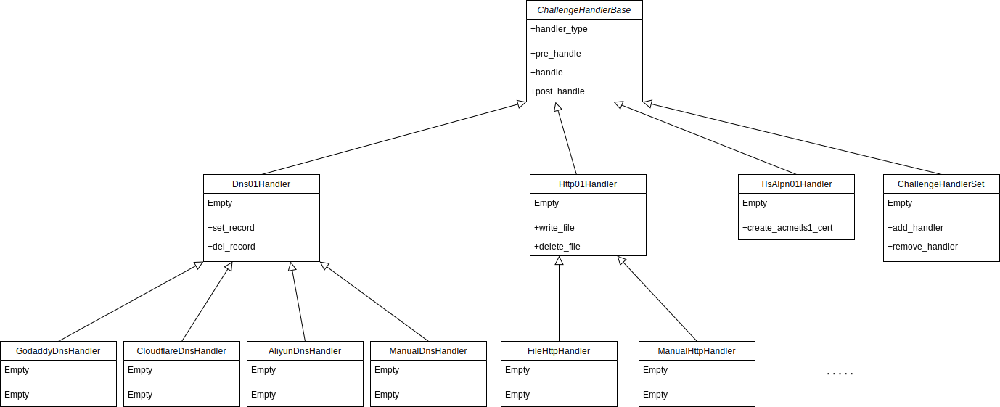

# Challenge Handling

ChallengeHandlers的结构如下：



ChanllengeHandlerBase是所有Handler的基类，定义了`pre_handle`、`handle`、`post_handle`三个抽象方法。pre_handle保留备用。handle()用于设置网络资源以满足ACME服务器的"挑战"要求，post_handle用于完成认证后解除这些网络资源。

## ChallengeHandlerBase

### handler_type 抽象属性

表示此Handler处理何种类型的"挑战"，与[RFC8555 section-9.7.8](https://datatracker.ietf.org/doc/html/rfc8555#section-9.7.8) 对应，通常是http-01、dns-01、tls-alpn-01。

### pre_handle 抽象方法

保留备用，所有子类应当实现此方法但不进行任何操作。

### handle 抽象方法

handle方法用于设置"挑战"所需的网络资源。

```python
def handle(url, id_type, id_value, token, key_thumbprint) -> bool
```

`url`：Challenge的URL，通常可唯一确定一个Challenge。<br>
`id_type`：此Challenge所属的Authorization对象的identifier的type，通常是"dns"。见[RFC8555 section-7.1.4](https://datatracker.ietf.org/doc/html/rfc8555#section-7.1.4) 。<br>
`id_value`：identifier的value。通常是等待认证的域名。<br>
`token`：服务器为此Challenge指定的token，用来计算key authorization。见[RFC8555 section-8.1](https://datatracker.ietf.org/doc/html/rfc8555#section-8.1) 。<br>
`key_thumbprint`：账户密钥的指纹，与token一起，用于计算key authorization。

handle方法返回True或False，指示"挑战"所需的网络资源是否被成功设置。

### post_handle 抽象方法

post_handle方法用于撤销为满足挑战所设置的网络资源。

```python
def post_handle(url, id_type, id_value, token, key_thumbprint, succeed) -> bool
```

`succeed`：之前的handle方法是否成功。<br>
其余参数与handle相同。

post_handle方法应返回True或False，指示资源是否被成功撤销。

## Dns01Handler

用于处理`dns-01`挑战。

Dns01Handler是一个抽象基类，包含set_record和del_record两个抽象方法。handle方法会调用set_record方法，post_handle方法调用del_record方法。<br>
`handle`方法将待处理的域名(id_value)分割成子域名和一级域名，并在子域名前加上`_acme-challenge.`前缀，计算满足挑战所需的TXT记录的值，传递给子类的set_record方法。`post_handle`方法进行同样的操作，并传递给子类的del_record方法。

考虑到有些DNS服务商使用唯一ID来标识一个DNS记录，大部分可通过此ID来删除对应的记录。Dns01Handler添加了record_id机制来简化此过程：<br>
set_record方法可返回所设置的DNS记录的ID，此返回值会原样传递给del_record方法的record_id参数。<br>
若set_record方法的返回值的真值判断为真，即`bool(set_record(...)) == True`，则此操作被认为是成功的，handle方法将返回True。同时在一个字典中建立从挑战url到此返回值的映射关系。post_handle方法被调用时，从此字典中弹出(pop)此返回值，作为record_id参数传递给del_record方法。若字典中不存在与之对应的返回值，record_id将传入None。

### txt_value 静态方法

计算TXT记录的值。`{token}.{key_thumbprint}`计算sha256哈希值，再用base64_url编码，去掉末尾填充的等号`=`。

### set_record 抽象方法

设置DNS TXT记录。

```python
def set_record(subdomain, fld, value)
```

`subdomain`：需要设置记录的子域名，已附加_acme-challenge.前缀。<br>
`fld`：需要设置记录的一级域名。<br>
`value`：需要设置的TXT记录值。

例如，需要认证的域名是abc.def.example.co.uk，则subdomain是abc.def，fld是example.co.uk。

当设置成功时，若DNS服务商提供记录ID，应返回记录ID，若不提供则返回True。当设置失败时应返回False。

### del_record 抽象方法

删除DNS TXT记录

```python
def del_record(subdomain, fld, value, record_id)
```
其余参数与set_record相同<br>
`record_id`：set_record返回的记录ID，注意对一个挑战，此参数只会被传递一次。例如<br>
```python
handler.handle(url, 'dns', 'examplr.org', token, thumbprint)
handler.post_handle(url, 'dns', 'examplr.org', token, thumbprint, True)
handler.post_handle(url, 'dns', 'examplr.org', token, thumbprint, True)
```
则第二次调用post_handle进而调用del_record时，此次调用的record_id参数将为None。

删除成功返回True，失败返回False。

## CloudflareDnshandler

处理托管在Cloudflare上的域名的dns-01挑战。

```python
c = CloudflareDnsHandler(api_token)
```

`api_token`：Cloudflare API-Token，我们已删除对API-Key的支持。

API-Token需要Zone.Zone.Read和Zone.DNS.Edit权限。前者用于通过域名获取Zone ID，后者用于编辑DNS记录。

**注意：** 若在调用del_record时提供了record_id，则del_record方法将直接删除此ID对应的记录，不检查value是否与DNS记录值相同。
